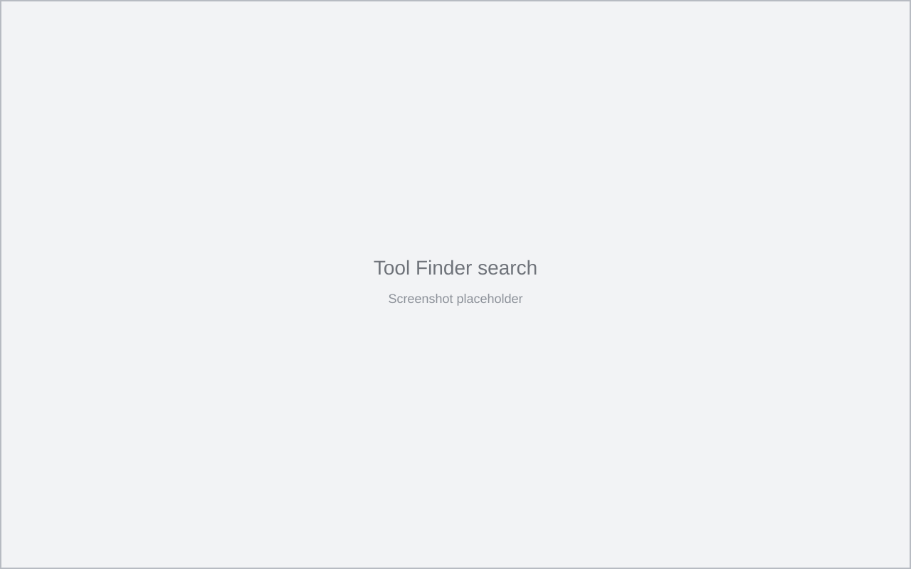

  

<h1 align="center">Tool Finder</h1>

  Find and open IDE tool windows from a keyboard-driven popup.

---

Tool Finder is an IntelliJ Platform plugin for finding tool windows without navigating the IDE menus.

Press <kbd>Ctrl</kbd>+<kbd>&#92;</kbd> (<kbd>Cmd</kbd>+<kbd>&#92;</kbd> on macOS), then type to filter tool windows by name.
The list separates visible, previously opened and unopened tool windows, and each row shows the tool window's own IDE
shortcut when it has one.

## Screenshots

## Shortcuts

| Key                                      | Action                                                       |
|------------------------------------------|--------------------------------------------------------------|
| <kbd>Ctrl</kbd>+<kbd>&#92;</kbd>            | Open or close Tool Finder                                   |
| Type                                     | Filter tool windows by name or ID                            |
| <kbd>Up</kbd> / <kbd>Down</kbd>          | Move the selection                                           |
| <kbd>Enter</kbd>                         | Activate the selected tool window, or hide it when it is focused |
| <kbd>Delete</kbd> / <kbd>Backspace</kbd> | Hide the selected active tool window when search is empty    |
| <kbd>Esc</kbd>                           | Clear the search, then close the popup                       |

On macOS, the default shortcut is <kbd>Cmd</kbd>+<kbd>&#92;</kbd>.

## Configuration

Open **Settings | Tools | Tool Finder** to include unavailable tool windows in the list. They are shown dimmed and
cannot be activated in the current context.

The same page toggles the keyboard hints shown at the bottom of the popup. They are enabled by default.

The shortcut can be changed under **Settings | Keymap** by searching for **Tool Finder**. The action is also available
from **Tools | Tool Finder**.

## Requirements

- IntelliJ Platform IDE version 2026.2 or later.
